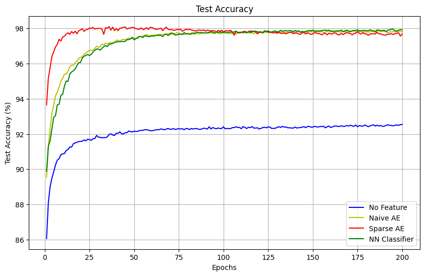

# MNIST_NN_Autoencoders
🚀 **Exploring Neural Networks and Autoencoders for MNIST Classification_new branch**

## 📌 Overview
This project explores different neural network architectures and autoencoders for handwritten digit classification using the MNIST dataset. The goal is to analyze the impact of model complexity, feature learning via autoencoders, and the effect of batch normalization and weight initialization on model performance.

---

## 📂 Dataset
**MNIST**: A dataset containing **60,000 training** and **10,000 test** grayscale images of handwritten digits (0-9), each of size **28×28** pixels.

---

## 🏗️ Implemented Models
We experiment with various deep learning architectures, including:

1. **Softmax Classifier** – A baseline model with only an input and output layer.
2. **Naive Autoencoder** – Learns to reconstruct MNIST digits in an unsupervised manner.
3. **Sparse Autoencoder** – Introduces sparsity constraints to improve feature representations.
4. **Autoencoder-Based Classifier** – Uses encoder features from the autoencoder for classification.
5. **Fully Connected Neural Network** – A shallow neural network with a single hidden layer.
6. **Deep Neural Network (5 Hidden Layers)** – Studies the effects of different weight initializations and batch normalization.

---

## 📊 Experiments & Findings
🔹 **Comparison of Classifiers:**  
   - The sparse autoencoder-based classifier outperformed the naive autoencoder and softmax classifier.  
   
🔹 **Effect of Batch Normalization:**  
   - Models trained with batch normalization converged faster and achieved higher accuracy.

🔹 **Weight Initialization Impact:**  
   - **He initialization** worked best for **ReLU** activations, leading to faster convergence.

---

## ⚙️ Dependencies
Ensure you have the following libraries installed before running the project:

```bash
pip install tensorflow numpy matplotlib
```
---
## 🚀 How to Run the Project
1. Clone the Repository:
```bash
git clone https://github.com/your-username/MNIST_NN_Autoencoders.git
cd MNIST_NN_Autoencoders
```
2. Run the Jupyter Notebook
```bash
jupyter notebook MNIST_NN_Autoencoders.ipynb
```
3. Follow the notebook to train and evaluate models.

---

## 📜 Results
1. The project demonstrates how different neural networks and autoencoder-based feature learning techniques impact classification accuracy.
2. Sparse autoencoders provide better features than naive autoencoders.
3. Batch normalization and proper weight initialization improve convergence and accuracy.


